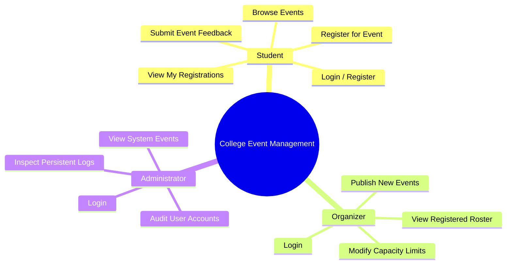
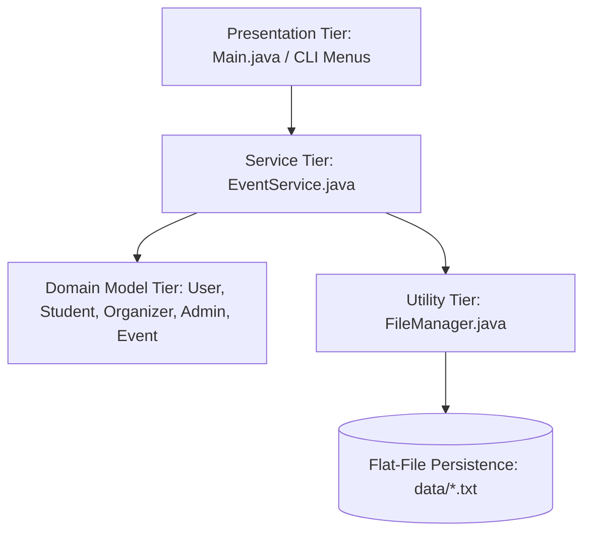
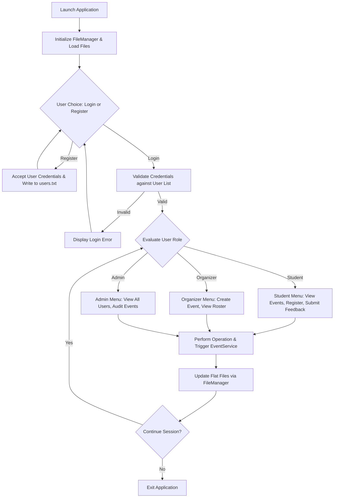
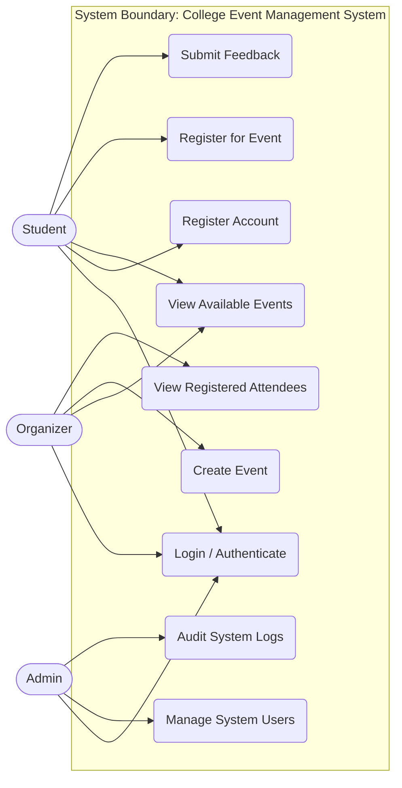
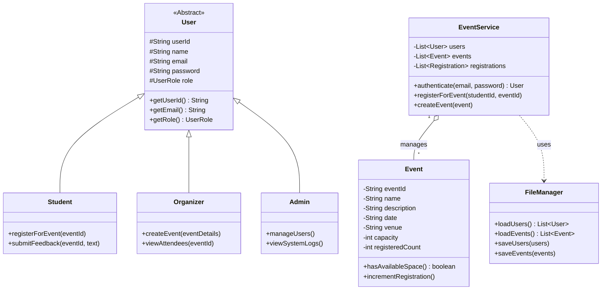
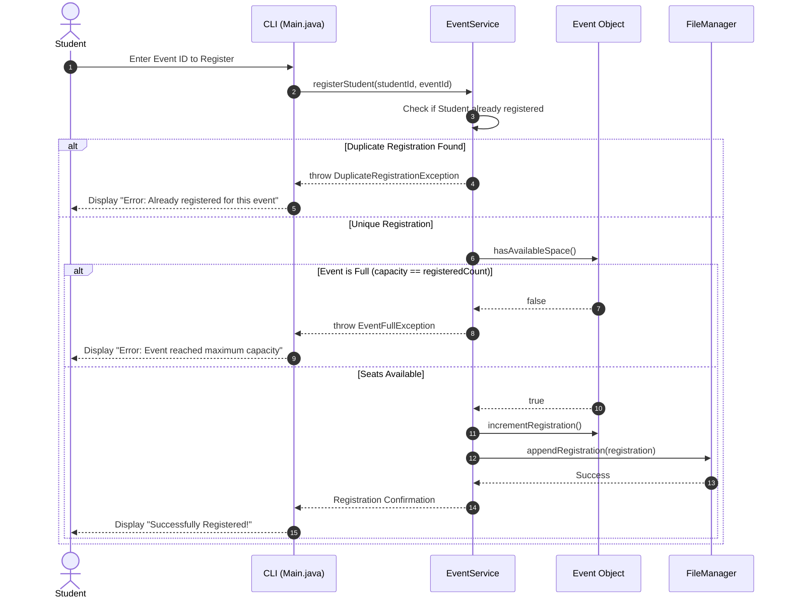
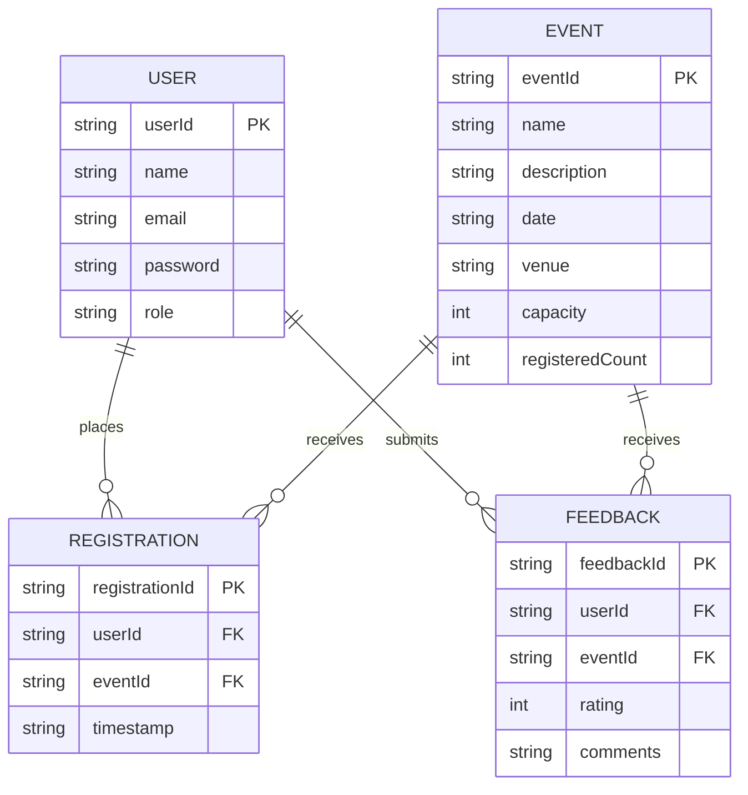

# COLLEGE EVENT MANAGEMENT SYSTEM

## PROJECT REPORT

### VITyarthi – Build Your Own Project

---

## COVER PAGE

### COLLEGE EVENT MANAGEMENT SYSTEM

**A Core Java Based Command-Line Application**

---

**Submitted By:**  
Rishabh Rai

**Course:**  
B.Tech – Computer Science and Engineering

**Specialization:**  
Artificial Intelligence & Machine Learning

**Project Type:**  
Build Your Own Project – VITyarthi

**Technology:**  
Pure Java (JDK 17+)

**Application Type:**  
Command-Line Application (CLI)

**Academic Year:**  
2026

---

# TABLE OF CONTENTS

1. Introduction
2. Problem Statement
3. Project Objectives
4. Scope of the Project
5. Target Users
6. Functional Requirements
7. Non-Functional Requirements
8. Technical Requirements
9. System Architecture
10. System Workflow
11. Use Case Diagram
12. Class Diagram
13. Sequence Diagram
14. Storage Design
15. Design Decisions and Rationale
16. Project Modules
17. Implementation Details
18. Java Concepts Used
19. Input and Output Design
20. Screenshots and Results
21. Testing Approach
22. Test Cases
23. Challenges Faced
24. Learnings and Key Takeaways
25. Limitations
26. Future Enhancements
27. Conclusion
28. References

---

# 1. INTRODUCTION

College events form a vital component of student engagement, skill development, and campus culture in modern higher education institutions. Academic departments, clubs, and student bodies regularly organize technical symposiums, hackathons, workshops, cultural festivals, sports meets, and guest lectures.

As the student body grows and the volume of events increases, manual coordination becomes prone to inefficiencies. Processing event registrations, validating venue capacity limits, capturing qualitative student feedback, and keeping student rosters synchronized across distinct campus bodies becomes increasingly complex.

The **College Event Management System** is developed to solve these operational challenges by offering a centralized, role-based platform designed in pure Core Java. The application provides dedicated operational views tailored to three core user roles: **Students**, **Organizers**, and **Administrators**.

The primary technical goal of this project is to demonstrate the practical application of fundamental and advanced Java programming principles without relying on heavy enterprise frameworks or external relational database engines. The system implements persistence through structured local flat files, showcasing end-to-end file operations, object-oriented domain modeling, custom exception hierarchies, data validation, and modular software packaging.

---

# 2. PROBLEM STATEMENT

Manual or semi-automated event management workflows present multiple operational bottlenecks across educational institutions:

1. **Inaccurate Registration Tracking:** Relying on paper lists or unvalidated digital forms results in duplicate registrations, corrupted student records, and inaccurate participant lists.
2. **Overbooking & Capacity Hazards:** Venues possess strict physical capacity limits. Without real-time validation checks, popular events risk being overbooked, causing logistical hazards and seating shortages.
3. **Lack of Role Separation:** Systems without strict access control allow non-authorized users to alter event schedules, edit attendee lists, or read restricted administrative logs.
4. **Data Persistence Loss:** Systems that run purely in-memory lose all event, user, and registration records upon application shut down.
5. **Absence of Feedback Channels:** Gathering student evaluations after events manually yields low participation and lacks direct structural linkage to specific event entries.

To solve these challenges, this project delivers a lightweight, reliable, command-line application built in pure Java that enforces strict role-based access control, automates real-time capacity and duplicate checks, and persists all data locally.

---

# 3. PROJECT OBJECTIVES

The key technical and functional objectives of this project are:

1. **Core Java Implementation:** Build a robust, modular application using pure Java (JDK 17+) with zero reliance on third-party frameworks or external database libraries.
2. **Role-Based Access Control (RBAC):** Implement strict authorization pipelines differentiating **Student**, **Organizer**, and **Administrator** capabilities.
3. **Automated Registration Engine:** Enforce dynamic capacity limits using custom exception handling (`EventFullException`) and prevent duplicate entries (`DuplicateRegistrationException`).
4. **Persistent Local Storage:** Develop a custom file persistence framework (`FileManager`) using Java File I/O (`java.io` / `java.nio`) to store entities across application executions.
5. **Feedback Loop Integration:** Provide students with a structured interface to submit qualitative feedback linked directly to events.
6. **Object-Oriented Excellence:** Demonstrate mastery over core Object-Oriented Design (OOD) principles including Encapsulation, Inheritance, Polymorphism, Abstraction, and the Java Collections Framework.

---

# 4. SCOPE OF THE PROJECT

The boundaries and operational scope of the project are defined below:

### In-Scope Functional Capabilities
- User registration and authentication engine.
- Role-based dashboard interfaces for Students, Organizers, and Admins.
- Event lifecycle management (creation, listing, capacity adjustment).
- Real-time event registration validation engine.
- Structured qualitative feedback collection.
- Persistent file storage (`users.txt`, `events.txt`, `registrations.txt`, `feedback.txt`).

### Out-of-Scope (Future Scope)
- Graphical User Interfaces (GUI) using JavaFX or Swing.
- Relational Database Management Systems (RDBMS) via JDBC/SQL.
- Network sockets, REST APIs, or web interfaces.
- Third-party email notification gateways or payment processor integrations.

---

# 5. TARGET USERS



## 5.1 Student
Students interact with the application to discover campus opportunities, secure seats at popular events, manage their personal event calendars, and submit reviews post-attendance.

## 5.2 Organizer
Organizers are faculty members or club leaders responsible for planning and executing events. They create new listings, monitor real-time attendee counts, enforce venue capacity constraints, and review participant feedback.

## 5.3 Administrator
Administrators oversee overall platform health, audit user accounts, monitor system-wide activity, and inspect stored data files to ensure operational integrity.

---

# 6. FUNCTIONAL REQUIREMENTS

## FR1 – User Authentication & Registration
- **FR1.1:** The system shall allow new users to register by providing their full name, valid email address, password, and assigned role.
- **FR1.2:** The system shall authenticate existing users using their email and password combination.
- **FR1.3:** The system shall reject invalid login attempts and display an appropriate error prompt.

## FR2 – Role-Based Access Routing
- **FR2.1:** Upon successful authentication, the system shall dynamically route users to their role-specific menu (Student Dashboard, Organizer Dashboard, or Admin Dashboard).
- **FR2.2:** Operations reserved for elevated roles (e.g., event creation) shall be inaccessible to lower-privileged accounts.

## FR3 – Event Creation & Management
- **FR3.1:** Organizers shall be able to create new events by specifying an Event ID, Name, Description, Date, Venue, and Maximum Capacity limit.
- **FR3.2:** Organizers shall be capable of viewing the complete roster of students registered for their specific events.

## FR4 – Event Browsing & Discovery
- **FR4.1:** Students shall be able to list all active campus events along with details including venue, schedule, total capacity, and available seats.

## FR5 – Event Registration Engine
- **FR5.1:** The system shall process event registration requests submitted by authenticated students.
- **FR5.2:** The system shall evaluate real-time capacity and throw an `EventFullException` if maximum capacity is reached.
- **FR5.3:** The system shall prevent duplicate registrations by throwing a `DuplicateRegistrationException` if the student has already registered for the specified Event ID.

## FR6 – Feedback System
- **FR6.1:** Students shall be able to submit qualitative reviews associated with events they have attended.
- **FR6.2:** Feedback entries shall be stored with the associated `UserId`, `EventId`, and `FeedbackText`.

## FR7 – Data Persistence & Retrieval
- **FR7.1:** The system shall save all user, event, registration, and feedback records to local flat text files upon state mutation.
- **FR7.2:** The system shall reload all stored records from flat files into Java Collection objects upon application boot.

---

# 7. NON-FUNCTIONAL REQUIREMENTS

## 7.1 Performance & Responsiveness
- All CLI menu navigations, list renderings, and validation routines shall execute in under $100\text{ ms}$.
- Data loading and file parsing routines shall maintain $O(N)$ computational complexity relative to file size.

## 7.2 Usability & User Experience
- The application shall offer a intuitive, numbered menu-driven Command Line Interface (CLI).
- Clear screen outputs, structured tables, and informative status banners shall guide user inputs.

## 7.3 Reliability & Robustness
- The application shall gracefully intercept malformed inputs (e.g., entering text into numeric prompts) without abruptly terminating execution.
- Transactional file writing procedures shall ensure data files are not corrupted during state changes.

## 7.4 Maintainability & Code Quality
- Source code shall strictly adhere to object-oriented separation of concerns using standardized package structures (`model`, `service`, `exception`, `util`).
- Naming conventions shall strictly comply with standard Java camelCase guidelines.

---

# 8. TECHNICAL REQUIREMENTS

| Component | Specification / Requirement |
| :--- | :--- |
| **Operating System** | Cross-platform (Windows 10/11, macOS, Linux) |
| **Runtime Environment** | Java Development Kit (JDK 17 or higher) |
| **User Interface** | Terminal / Command Prompt / PowerShell |
| **Version Control** | Git & GitHub |
| **External Dependencies** | **Zero** (Pure JDK Standard Library) |
| **Minimum Hardware** | Dual-Core CPU, 2 GB RAM, 50 MB Free Storage |

---

# 9. SYSTEM ARCHITECTURE

The application follows a clean, 4-tier modular layered design:



### Layer Details
1. **Presentation Layer (`Main.java`):** Captures user keyboard input, processes menu selections, and renders terminal output formats.
2. **Service Layer (`EventService.java`):** Encapsulates core business logic, validation algorithms, capacity verification, and state updates.
3. **Domain Model Layer (`model/`):** Represents entity structures (`User`, `Student`, `Organizer`, `Admin`, `Event`, `Registration`, `Feedback`) leveraging inheritance and encapsulation.
4. **Data Utility Layer (`FileManager.java`):** Executes low-level stream reading/writing and string parsing to bridge in-memory objects with flat text files.

---

# 10. SYSTEM WORKFLOW



---

# 11. USE CASE DIAGRAM



---

# 12. CLASS DIAGRAM



---

# 13. SEQUENCE DIAGRAM

### Event Registration Process with Exception Flow



---

# 14. STORAGE DESIGN

The system uses standard flat files (`.txt`) with delimiter-separated lines (using `|` as the column separator).

```
data/
│
├── users.txt
├── events.txt
├── registrations.txt
└── feedback.txt
```

### 14.1 `users.txt` Format
`UserId|Name|Email|Password|Role`
*Example:* `U101|Rishabh Rai|student@college.com|student123|STUDENT`

### 14.2 `events.txt` Format
`EventId|Name|Description|Date|Venue|Capacity|RegisteredCount`
*Example:* `E201|Tech Symposium|Annual AI & Tech Fest|2026-04-15|Main Auditorium|100|45`

### 14.3 `registrations.txt` Format
`RegistrationId|StudentId|EventId|Timestamp`
*Example:* `R501|U101|E201|2026-03-10T10:15:30`

### 14.4 `feedback.txt` Format
`FeedbackId|StudentId|EventId|Rating|Comments`
*Example:* `F801|U101|E201|5|Excellent organization and sessions!`

---

# 15. STORAGE RELATIONSHIP / ER-STYLE DESIGN

While flat files do not enforce referential integrity constraints natively, logical entity relationships are enforced by business logic in `EventService.java`:



---

# 16. DESIGN DECISIONS AND RATIONALE

1. **Pure Core Java (Zero Frameworks):** Implemented using standard Java (JDK 17+) without Spring Boot, Hibernate, or external SQL drivers to fulfill academic criteria and emphasize fundamental language mechanics.
2. **Flat-File Storage vs. RDBMS:** Using `java.io` stream handlers instead of an external database ensures zero external installation dependencies, making the project portable across environments.
3. **Custom Exceptions (`EventFullException`, `DuplicateRegistrationException`):** Extending `java.lang.Exception` allows domain-specific operational failures to be intercepted cleanly, separating business logic failures from system bugs.
4. **Command-Line Interface:** Selected to ensure lightweight execution across standard terminal environments without graphics system dependencies.

---

# 17. PROJECT MODULES

1. **Authentication & User Management Module:** Handles user account creation, credentials parsing, password verification, and role resolution.
2. **Event Lifecycle Module:** Handles creation, detail modification, roster listing, and venue capacity tracking for event listings.
3. **Registration & Validation Engine:** Coordinates student registration, enforces single-registration rules, and tracks seat availability in real time.
4. **Feedback Module:** Captures ratings and text reviews, linking student reviews back to specific events.
5. **Data Persistence Module (`FileManager`):** Translates in-memory object graph structures to disk-bound flat text representations and vice versa.

---

# 18. IMPLEMENTATION DETAILS

### Package Layout
```
com.collegeevent
│
├── Main.java
├── model/
│   ├── User.java
│   ├── Student.java
│   ├── Organizer.java
│   ├── Admin.java
│   ├── Event.java
│   ├── Registration.java
│   └── Feedback.java
├── service/
│   └── EventService.java
├── exception/
│   ├── EventFullException.java
│   └── DuplicateRegistrationException.java
└── util/
    └── FileManager.java
```

---

# 19. JAVA CONCEPTS USED

| Java Concept | Application in Project |
| :--- | :--- |
| **Object-Oriented Design** | Model domain entities using classes, fields, and constructors. |
| **Encapsulation** | Private instance variables accessed via getter/setter methods. |
| **Inheritance** | `Student`, `Organizer`, and `Admin` extend abstract `User` base class. |
| **Polymorphism** | Role-specific menu actions triggered dynamically. |
| **Collections Framework** | `ArrayList` for sequence indexing; `HashMap` for efficient lookups. |
| **Custom Exceptions** | `EventFullException` and `DuplicateRegistrationException` handle business logic errors. |
| **File I/O (`java.io`)** | `BufferedReader`, `BufferedWriter`, `FileReader`, and `FileWriter` process flat text files. |
| **Enums** | Strong typing for user roles (`UserRole.STUDENT`, `UserRole.ORGANIZER`, `UserRole.ADMIN`). |

---

# 20. INPUT AND OUTPUT DESIGN

### Command-Line Input Sample
```text
==================================================
        COLLEGE EVENT MANAGEMENT SYSTEM
==================================================
1. Register
2. Login
3. Exit
Select Option: 2

Enter Email: student@college.com
Enter Password: student123
Login Successful! Welcome, Rishabh Rai (STUDENT)
```

---

# 21. APPLICATION EXECUTION

### Method 1 – Executing via Shell Scripts
```bash
# macOS / Linux
cd CollegeEventManagement_PureJava-2
chmod +x run.sh
./run.sh

# Windows (Command Prompt)
run.bat
```

### Method 2 – Manual Compilation & Execution
```bash
# Compile
mkdir -p out
javac -d out $(find src -name "*.java")

# Run Application
java -cp out com.collegeevent.Main
```

---

# 22. DEMO CREDENTIALS

| Role | Email Address | Password | Default Capabilities |
| :--- | :--- | :--- | :--- |
| **Admin** | `admin@college.com` | `admin123` | Full system audit, view users & events |
| **Organizer** | `organizer@college.com` | `org123` | Create events, manage capacity, view attendee lists |
| **Student** | `student@college.com` | `student123` | Browse events, register for seats, submit feedback |

---

# 23. SCREENSHOTS AND RESULTS

*(Note: Embed actual terminal execution captures in the final document)*

- **Screen 1:** Application Splash Banner & Login Menu
- **Screen 2:** Student Event Dashboard & Available Listings
- **Screen 3:** Successful Event Registration Flow
- **Screen 4:** Exception Interception (`DuplicateRegistrationException`)
- **Screen 5:** Exception Interception (`EventFullException`)
- **Screen 6:** Organizer Dashboard & New Event Creation Prompt
- **Screen 7:** Admin Dashboard User Record Inspection

---

# 24. TESTING APPROACH

Testing was performed using structured scenario-based manual test suites covering positive paths, input boundary conditions, and exception scenarios.

---

# 25. TEST CASES

| Test ID | Scenario | Input | Expected Result | Status |
| :--- | :--- | :--- | :--- | :--- |
| **TC01** | Valid Student Login | `student@college.com` / `student123` | Login successful, route to Student Dashboard. | **PASS** |
| **TC02** | Invalid Credentials | `unknown@user.com` / `wrongpass` | Authenticate fails; prompt "Invalid Credentials". | **PASS** |
| **TC03** | Event Creation | Valid Event fields (Capacity: 50) | Event added to memory & persisted to `events.txt`. | **PASS** |
| **TC04** | Valid Registration | Available Event ID | Student registered; available seat count decremented by 1. | **PASS** |
| **TC05** | Duplicate Registration | Re-enter already registered Event ID | Catch `DuplicateRegistrationException`; abort registration. | **PASS** |
| **TC06** | Capacity Overflow | Register for event with 0 seats remaining | Catch `EventFullException`; abort registration. | **PASS** |
| **TC07** | Feedback Entry | Submit 5-star review for registered event | Feedback persisted to `feedback.txt`. | **PASS** |

---

# 26. CHALLENGES FACED

1. **Flat-File Synchronization:** Guaranteeing memory state synchronized reliably with text file state across updates without leaving temporary data unwritten. Solved using atomic file update practices in `FileManager`.
2. **Custom Exception Routing:** Ensuring custom runtime exceptions (`EventFullException`, `DuplicateRegistrationException`) were caught cleanly at the presentation layer without crashing terminal loops.
3. **Data Parsing Robustness:** Handling special character breaks and whitespace trimming in parsing operations over `users.txt` and `events.txt`.

---

# 27. LEARNINGS AND KEY TAKEAWAYS

- Deepened expertise in Java Object-Oriented Principles (Abstraction, Encapsulation, Polymorphism, Inheritance).
- Hands-on experience building custom exception hierarchies and structured exception propagation.
- Practical understanding of stream I/O operations and manual data parsing techniques.
- Principles of role-based software design and system architecture separation.

---

# 28. LIMITATIONS

1. **Interface Restriction:** Text-based CLI lacks graphical controls like buttons or date pickers.
2. **File Concurrent Access:** Flat text files lack hardware-level record locks, making the storage model unsuited for multi-threaded distributed operations.
3. **Search Capabilities:** Complex search filtering requires loading data arrays completely into memory.

---

# 29. FUTURE ENHANCEMENTS

1. **Graphical User Interface:** Build a JavaFX desktop front-end.
2. **Database Migration:** Replace flat file utilities with JDBC and a PostgreSQL / MySQL database.
3. **Notification Engine:** Add JavaMail API bindings to transmit confirmation emails to students.
4. **Automated Unit Testing:** Add JUnit 5 test cases to validate domain models and services automatically.

---

# 30. CONCLUSION

The **College Event Management System** provides an efficient platform for managing student event participation, organizer workflows, and administrative audits using pure Core Java.

By avoiding heavy external dependencies, the system highlights core software engineering principles including Object-Oriented Design, modular package structure, file I/O operations, custom exception handling, and role-based access control. The architecture provides a solid base for future upgrades, such as graphical interfaces and database backends.

---

# 31. REFERENCES

1. Oracle Java Documentation: Core Java Standard API (JDK 17).
2. Bloch, Joshua. *Effective Java*, 3rd Edition, Addison-Wesley Professional.
3. Gamma et al. *Design Patterns: Elements of Reusable Object-Oriented Software*, Addison-Wesley.
4. Core Java Course Lecture Notes & VITyarthi Project Guidelines.