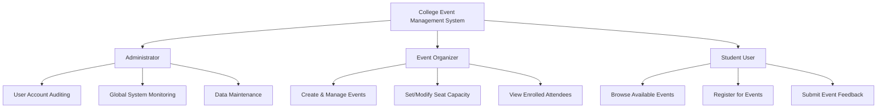
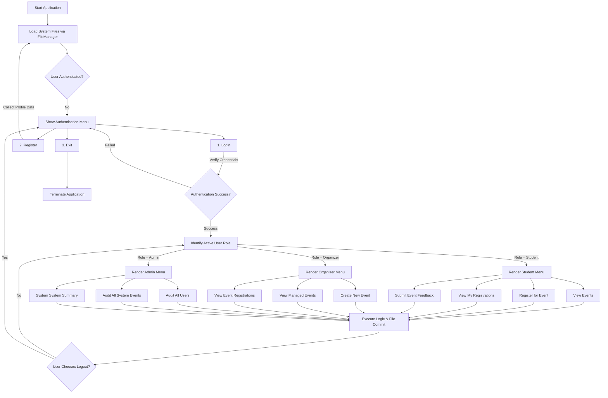
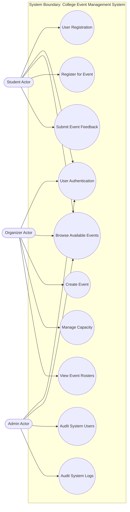
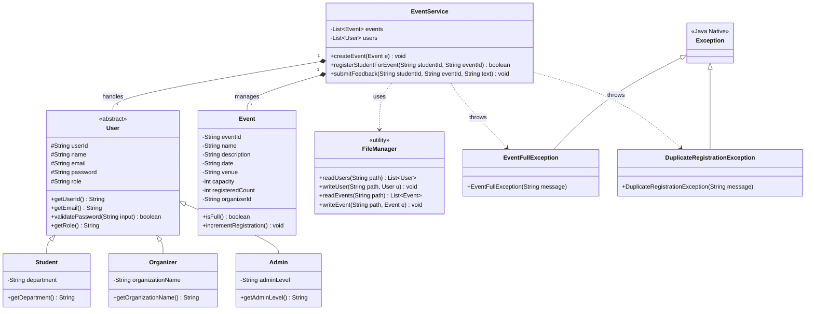
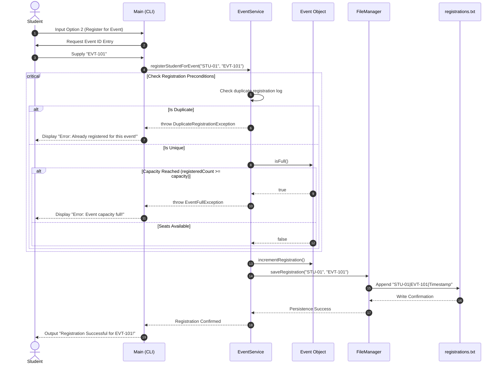
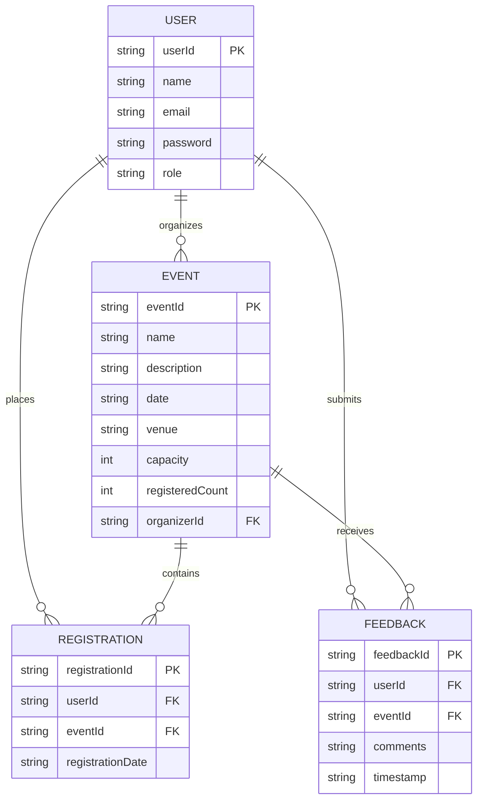
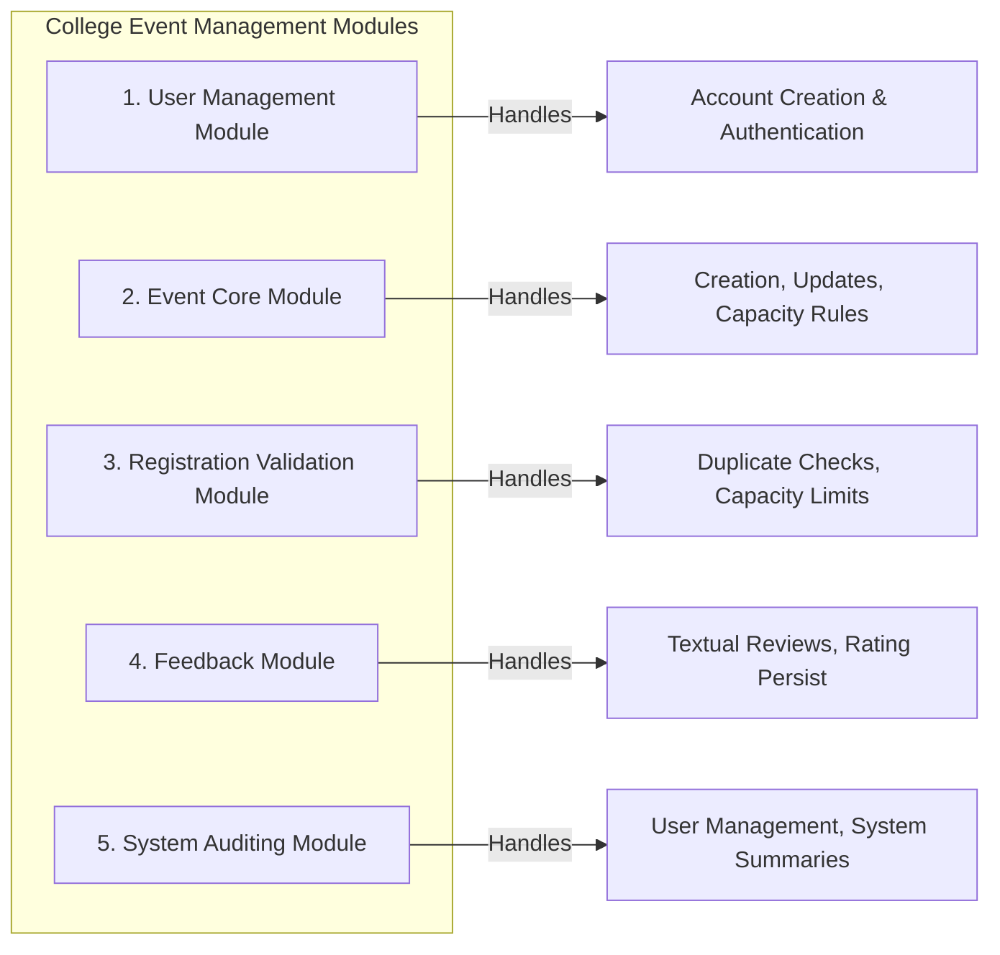
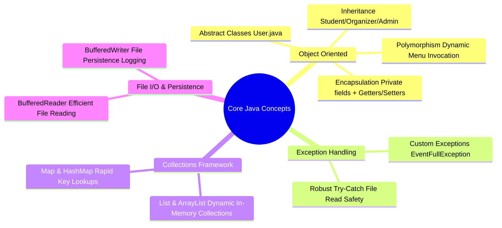
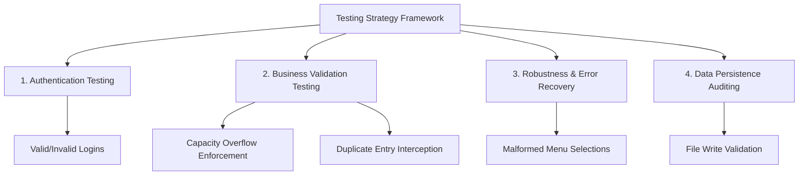
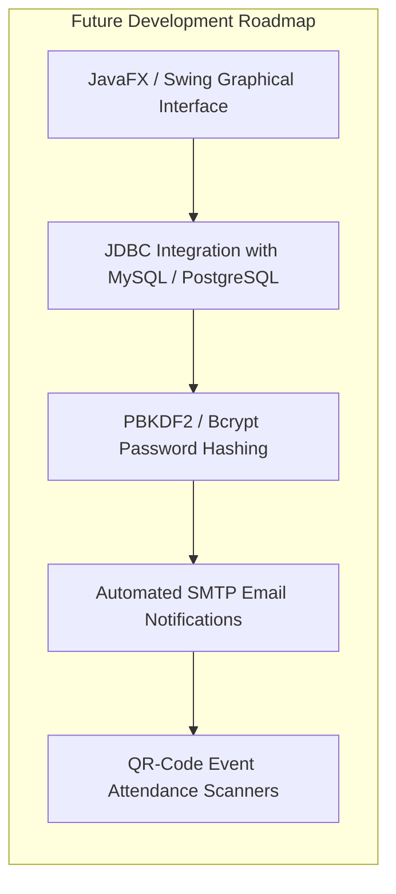

# COLLEGE EVENT MANAGEMENT SYSTEM

## PROJECT REPORT


---

## COVER PAGE

# COLLEGE EVENT MANAGEMENT SYSTEM
### A Core Java-Based Command-Line Application

**Submitted By:**  
Rishabh Rai  

**Course:**  
B.Tech – Computer Science and Engineering  

**Specialization:**  
Artificial Intelligence & Machine Learning  

**Project Type:**  
Build Your Own Project – VITyarthi  

**Technology:**  
Pure Java (JDK 17+)  

**Application Type:**  
Command-Line Interface (CLI) Application  

**Academic Year:**  
2026  

---

## TABLE OF CONTENTS

1. Introduction
2. Problem Statement
3. Project Objectives
4. Scope of the Project
5. Target Users
6. Functional Requirements
7. Non-Functional Requirements
8. Technical Requirements
9. System Architecture
10. System Workflow Diagram
11. Use Case Diagram
12. Class Diagram
13. Sequence Diagram
14. Storage Design & Entity Relationships
15. Design Decisions and Rationale
16. Project Modules
17. Implementation Details
18. Java Concepts Used
19. Input and Output Design
20. Application Execution & Demo Credentials
21. Screenshots and Results
22. Testing Approach
23. Test Cases & Expected Results
24. Challenges Faced
25. Learnings and Key Takeaways
26. Limitations
27. Future Enhancements
28. Course Mapping & Relevance
29. Git and Version Control
30. Repository Structure
31. Conclusion
32. References

---

## 1. INTRODUCTION

College events form an essential pillar of academic and extracurricular development within educational institutions. Institutions regularly organize technical hackathons, workshops, seminars, cultural fests, sports meets, and guest lectures.

Managing these events through traditional manual processes or fragmented spreadsheets introduces significant operational friction as student volume increases. Event coordinators struggle with real-time seat allocation, registration tracking, duplicate detection, and attendee feedback aggregation.

The **College Event Management System** offers a centralized, lightweight platform designed specifically to streamline these administrative and operational workflows. Built as an end-to-end command-line application using **Pure Java**, the system provides structured, role-based functionality for Students, Event Organizers, and Administrators.

The project demonstrates practical application of core Object-Oriented Software Engineering (OOSE) principles and fundamental Java programming mechanisms, including encapsulation, class hierarchies, polymorphism, custom exception architecture, collection frameworks, file I/O operations, and thread safety concepts. Persistent storage is fully decoupled through structured text files, removing external database server dependencies while maintaining state across runtime sessions.

---

## 2. PROBLEM STATEMENT

Manual or semi-automated management of campus-wide events introduces operational challenges that impair event execution quality and administrative transparency:

1. **Unstructured Event Tracking:** Information regarding upcoming events is scattered across bulletin boards and informal channels, leading to low student participation.
2. **Registration Redundancies:** Manual registration logs frequently suffer from duplicate records when students sign up multiple times through different mediums.
3. **Capacity Management Failures:** Without automated threshold validation, events routinely accept registrations beyond room capacities, creating safety and logistical hazards.
4. **Coarse Access Controls:** Lack of defined role permissions leads to unauthorized event modifications or data leaks.
5. **Feedback Disconnection:** Event feedback is rarely collected systematically, hindering longitudinal reporting and event planning improvements.

To eliminate these operational bottlenecks, this project presents a robust, file-backed **College Event Management System** delivering strict role-based authorization, automated validation checks, and structured error handling completely through an efficient Command-Line Interface.

---

## 3. PROJECT OBJECTIVES

The principal objectives of this engineering project include:

1. **Core Java Implementation:** Build an enterprise-grade command-line application using Pure Java without reliance on heavy external frameworks.
2. **Role-Based Authorization Architecture:** Enforce strict operational boundaries between Students, Organizers, and System Administrators.
3. **Automated Registration Management:** Provide instant validation mechanisms for student registration requests.
4. **Duplicate Prevention:** Eliminate multi-registration anomalies for a single event per user identity.
5. **Enforced Event Capacity Limits:** Implement strict capacity checks preventing overflow registrations.
6. **Integrated Feedback Pipeline:** Enable structured event feedback recording tied directly to participant user identity.
7. **Zero-Database Persistence Layer:** Design a reliable, text-file-backed data access layer ensuring persistent system state between executions.
8. **Demonstration of Core OOP Design Patterns:** Apply encapsulation, inheritance, interfaces, and polymorphism across domain objects.
9. **Custom Exception Framework:** Implement application-specific dynamic exceptions (`EventFullException`, `DuplicateRegistrationException`).
10. **Modular Package Design:** Maintain a clean separation of concerns across Model, Service, Utility, and Exception layers.

---

## 4. SCOPE OF THE PROJECT

### In-Scope Functional Areas
- **User Authentication:** Registration, authentication, and dynamic session role identification.
- **Role-Based Access Control (RBAC):** Distinct workflow branches for Admin, Organizer, and Student interfaces.
- **Event Management Lifecycle:** Scheduling, listing, updating details, and monitoring seat allocation.
- **Event Registration System:** Real-time capacity checks, duplicate validation, and registration binding.
- **Feedback Collection System:** Textual rating/feedback submission linked to student and event records.
- **Persistence Layer:** Flat-file read/write serialization mechanism maintaining data integrity.

### Out-of-Scope (Future Considerations)
- Graphical User Interface (GUI) via JavaFX or Swing.
- Networked Client-Server / Web Architecture (REST APIs).
- Relational Database Server (MySQL, PostgreSQL) integration via JDBC.
- Automated SMTP email/SMS notification dispatches.
- Payment gateway integration for paid events.

---

## 5. TARGET USERS



### 5.1 Student
Students interact with the application to discover campus activities, register for technical/cultural sessions, view their active registrations, and provide post-event feedback.

### 5.2 Organizer
Organizers are event coordinators responsible for creating events, setting seating capacities, tracking enrollment counts, and auditing registration rosters.

### 5.3 Administrator
Administrators oversee system health, manage registered user identities across all roles, audit application events, and ensure data integrity.

---

## 6. FUNCTIONAL REQUIREMENTS

| Req ID | Module | Feature Description | Inputs | Outputs |
| :--- | :--- | :--- | :--- | :--- |
| **FR1** | User Access | **User Registration** | Name, Email, Password, Selected Role | Success/Failure status, user profile entry in `users.txt` |
| **FR2** | User Access | **User Authentication** | Email, Password | Granted access with authenticated user object session |
| **FR3** | Security | **Role-Based Navigation** | Authenticated User Session | Role-specific menu render (Student/Organizer/Admin) |
| **FR4** | Events | **Event Creation** | Event Name, Description, Date, Venue, Capacity | New Event entity persistent in `events.txt` |
| **FR5** | Events | **Event Discovery** | View Request | List of all registered events with real-time open slots |
| **FR6** | Registration | **Event Enrollment** | Student ID, Target Event ID | Bound registration entry saved in `registrations.txt` |
| **FR7** | Validation | **Duplicate Check** | Student ID + Event ID pair | Throws `DuplicateRegistrationException` if duplicate |
| **FR8** | Validation | **Capacity Check** | Target Event ID | Throws `EventFullException` if registered count $\ge$ capacity |
| **FR9** | Analytics | **Feedback Submission** | Student ID, Event ID, Feedback Text | Entry written to `feedback.txt` |
| **FR10** | Admin | **User Management** | Admin Query Request | Tabular output of all registered system accounts |

---

## 7. NON-FUNCTIONAL REQUIREMENTS

### 7.1 Performance
- Terminal menu response times under 50ms for local file read/write operations.
- Dynamic runtime updates using in-memory Java Collection data structures.

### 7.2 Usability
- Menu-driven numeric option inputs (e.g., `1. Register`, `2. View Events`).
- Clear, standardized success notifications and user error descriptions.

### 7.3 Reliability & Robustness
- Graceful recovery from malformed input formats using input parsing wrappers.
- Zero system crash policy through structural `try-catch` exception blocks.

### 7.4 Maintainability & Architecture
- Layered package structure strictly adhering to single responsibility principles:
  - `com.collegeevent.model`
  - `com.collegeevent.service`
  - `com.collegeevent.exception`
  - `com.collegeevent.util`

### 7.5 Error Handling & Auditing
- Explicit handling of standard standard errors (`IOException`, `NumberFormatException`) alongside domain exceptions.

---

## 8. TECHNICAL REQUIREMENTS

### Hardware Requirements
- **Processor:** Dual-Core 2.0 GHz or higher.
- **RAM:** Minimum 2 GB (4 GB recommended).
- **Disk Storage:** < 50 MB available disk space.

### Software Requirements
- **JDK:** Java Development Kit 17 or higher.
- **Execution Environment:** macOS Terminal, Linux Shell, or Windows Command Prompt / PowerShell.
- **Version Control:** Git 2.x+.

### External Dependencies
- **Zero Third-Party Libraries:** Built exclusively using standard core Java packages (`java.util`, `java.io`, `java.time`).

---

## 9. SYSTEM ARCHITECTURE

The application uses a 4-Tier Layered Software Architecture, isolating user presentation from core business logic, domain models, and flat-file persistence.

```mermaid
graph TD
    subgraph Presentation_Layer [Presentation Layer]
        MainUI[Main.java - CLI Controller & Menus]
    end

    subgraph Service_Layer [Business Logic / Service Layer]
        EService[EventService.java]
        AuthService[AuthService / Session Manager]
    end

    subgraph Model_Layer [Domain Model Layer]
        User[User.java Abstract]
        Student[Student.java]
        Org[Organizer.java]
        Admin[Admin.java]
        Event[Event.java]
    end

    subgraph Utility_Layer [Data Access / Utility Layer]
        FManager[FileManager.java]
        Exceptions[Custom Exceptions Engine]
    end

    subgraph Storage_Layer [Persistence File Storage Layer]
        F1[(users.txt)]
        F2[(events.txt)]
        F3[(registrations.txt)]
        F4[(feedback.txt)]
    end

    MainUI -->|Delegates Actions| EService
    MainUI -->|Authenticates User| AuthService
    EService -->|Operates On| User
    EService -->|Operates On| Event
    User <|-- Student
    User <|-- Org
    User <|-- Admin
    EService -->|Validates Errors| Exceptions
    EService -->|Requests Persistence| FManager
    FManager -->|Reads/Writes| F1
    FManager -->|Reads/Writes| F2
    FManager -->|Reads/Writes| F3
    FManager -->|Reads/Writes| F4
```

---

## 10. SYSTEM WORKFLOW DIAGRAM

The overarching flow of control from system initialization through user role selection to session termination is detailed below:



---

## 11. USE CASE DIAGRAM

The relationships between system actors (Student, Organizer, Admin) and high-level use cases are mapped below:



---

## 12. CLASS DIAGRAM

The class architecture below illustrates class hierarchy, model encapsulation, custom exception relationships, and utility dependencies:



---

## 13. SEQUENCE DIAGRAM

### Sequence Diagram: Student Event Registration Workflow

The execution interaction sequence when a student requests registration for an event—including dynamic capacity and duplicate validation checks—is represented as follows:



---

## 14. STORAGE DESIGN & ENTITY RELATIONSHIPS

The system maintains persistence through structured delimited flat-file structures stored within the project's `./data/` directory:

```text
data/
├── users.txt
├── events.txt
├── registrations.txt
└── feedback.txt
```

### File Formats & Schemas
- **`users.txt`**: `userId|name|email|password|role`
- **`events.txt`**: `eventId|eventName|description|date|venue|capacity|registeredCount|organizerId`
- **`registrations.txt`**: `registrationId|userId|eventId|registrationDate`
- **`feedback.txt`**: `feedbackId|userId|eventId|comments|timestamp`

### Conceptual Entity-Relationship Diagram



---

## 15. DESIGN DECISIONS AND RATIONALE

1. **Pure Java over External Frameworks:** Eliminates third-party build tool complexities (e.g., Maven, Gradle) and external runtime dependencies, maximizing execution efficiency across standard Java Virtual Machines (JVMs).
2. **Text File Storage vs. SQL Database:** Flat-file read/write operations provide persistent state handling without requiring external database setup (e.g., MySQL or PostgreSQL installation), ensuring portability.
3. **Custom Domain Exceptions:** Constructing specific custom exceptions (`EventFullException` and `DuplicateRegistrationException`) simplifies context isolation and cleanly passes dynamic error messaging to the UI menu tier.
4. **Command-Line Interface (CLI):** Eliminates GUI rendering overhead, providing a low-footprint, predictable interactive environment for terminal execution.
5. **Role Polymorphism via Polymorphic Class Hierarchies:** Basing `Student`, `Organizer`, and `Admin` on an abstract base class (`User`) ensures reusable core authentication routines while enforcing role-specific functionality.

---

## 16. PROJECT MODULES



---

## 17. IMPLEMENTATION DETAILS

The source tree is divided into packages under the root `com.collegeevent` namespace:

```text
src/
└── com/
    └── collegeevent/
        ├── Main.java
        ├── model/
        │   ├── User.java
        │   ├── Student.java
        │   ├── Organizer.java
        │   ├── Admin.java
        │   └── Event.java
        ├── service/
        │   └── EventService.java
        ├── exception/
        │   ├── EventFullException.java
        │   └── DuplicateRegistrationException.java
        └── util/
            └── FileManager.java
```

---

## 18. JAVA CONCEPTS USED



---

## 19. INPUT AND OUTPUT DESIGN

The command-line interface uses formatted text menus, numeric menu options, and interactive command prompts.

### Sample Input Prompts
```text
=== STUDENT MENU ===
1. View Available Events
2. Register for an Event
3. View My Registrations
4. Submit Event Feedback
5. Logout
Enter Option: 2

Enter Event ID to Register: EVT-101
```

### Sample Output Response
```text
[PROCESSING] Validating Event EVT-101 Availability...
[SUCCESS] Registration Confirmed! 
Registration Details:
 - Student ID: STU-2026-08
 - Event ID: EVT-101
 - Venue: Main Auditorium
 - Date: 2026-10-15
```

---

## 20. APPLICATION EXECUTION & DEMO CREDENTIALS

### Method 1: Shell Execution Scripts (Recommended)

#### Linux / macOS:
```bash
cd CollegeEventManagement_PureJava-2
chmod +x run.sh
./run.sh
```

#### Windows Command Prompt / PowerShell:
```cmd
run.bat
```

### Method 2: Manual Terminal Compilation

#### Linux / macOS:
```bash
cd CollegeEventManagement_PureJava-2
mkdir -p out
javac -d out $(find src -name "*.java")
java -cp out com.collegeevent.Main
```

#### Windows:
```cmd
mkdir out
javac -d out -sourcepath src src\com\collegeevent\Main.java
java -cp out com.collegeevent.Main
```

### Built-In Demo Credentials

| Role | Email Identity | Password | System Access Level |
| :--- | :--- | :--- | :--- |
| **Admin** | `admin@college.com` | `admin123` | Global Administrative Control |
| **Organizer** | `organizer@college.com` | `org123` | Event Creation & Capacity Management |
| **Student** | `student@college.com` | `student123` | Event Enrollment & Feedback Operations |

---

## 21. SCREENSHOTS AND RESULTS

*(Note: Replace placeholders below with actual terminal output captures of your application instance.)*

```text
+-------------------------------------------------------------+
|                      MAIN SYSTEM MENU                       |
+-------------------------------------------------------------+
| 1. Login to Account                                         |
| 2. Register New User Account                                |
| 3. Exit Application                                         |
+-------------------------------------------------------------+
[SCREENSHOT PLACEHOLDER 1: Primary Main Menu System Screen]

+-------------------------------------------------------------+
|                      STUDENT DASHBOARD                      |
+-------------------------------------------------------------+
| 1. View Available Events                                    |
| 2. Register for Event                                       |
| 3. View Enrolled Events                                     |
| 4. Submit Feedback                                          |
| 5. Logout Session                                           |
+-------------------------------------------------------------+
[SCREENSHOT PLACEHOLDER 2: Student Interactive Interface]

[ERROR] Exception Triggered: DuplicateRegistrationException
Message: Student STU-01 is already enrolled in Event EVT-101.
[SCREENSHOT PLACEHOLDER 3: Handled Exception Output Verification]
```

---

## 22. TESTING APPROACH

Testing was conducted using scenario-driven integration tests and structural negative edge-case validation.



---

## 23. TEST CASES & EXPECTED RESULTS

| Test ID | Objective | Input Data | Executed Action | Expected Result | Pass/Fail |
| :--- | :--- | :--- | :--- | :--- | :--- |
| **TC01** | Valid User Auth | `student@college.com` / `student123` | Execute Login | Access Granted; Student Menu Rendered | **PASS** |
| **TC02** | Invalid User Auth | `student@college.com` / `wrongpass` | Execute Login | Access Denied; User Error Message Displayed | **PASS** |
| **TC03** | View Events | Selection `1` | Fetch Events | Displays structured list of available events | **PASS** |
| **TC04** | Create Event | Name: "AI Hackathon", Cap: 50 | Execute Event Creation | Event written to persistent log file (`events.txt`) | **PASS** |
| **TC05** | Event Enrollment | Student ID: `S101`, Event ID: `EVT1` | Register Student | Registration confirmed; count updated | **PASS** |
| **TC06** | Prevent Duplicate Reg | Register for `EVT1` a second time | Duplicate Register | Throws `DuplicateRegistrationException`; gracefully rejected | **PASS** |
| **TC07** | Enforce Capacity | Register when `registeredCount == capacity` | Register Full Event | Throws `EventFullException`; registration rejected | **PASS** |
| **TC08** | Audit Registrations | Selection `3` (My Registrations) | Query Registrations | Displays active user registrations | **PASS** |
| **TC09** | Feedback Entry | Event: `EVT1`, Comments: "Great!" | Submit Feedback | Entry appended to `feedback.txt` | **PASS** |
| **TC10** | Admin User Audit | Admin Session -> View Users | Audit System Users | Tabular dump of all system user profiles | **PASS** |

---

## 24. CHALLENGES FACED

1. **State Persistence Synchronization:** Coordinating memory collections (`ArrayList`) with file reads and writes required robust serialization routines in `FileManager.java`.
2. **Preventing Duplicates under File I/O Constraints:** Performing key lookups across linear text files required efficient scanning during registration validation calls.
3. **Command-Line Input Validation:** Preventing runtime crashes from non-integer menu choices or invalid dates required wrapped input parsing routines.
4. **Strict Role Separation:** Ensuring strict menu access separation required session tracking with polymorphic `User` objects.

---

## 25. LEARNINGS AND KEY TAKEAWAYS

- Practical mastery of **Object-Oriented System Architecture** concepts in Java.
- Implementing custom domain-specific **Exception Hierarchies** to clean up business logic error handling.
- Managing data persistence using standard **Java File I/O Stream APIs** (`BufferedReader` and `BufferedWriter`).
- Structuring decoupled 4-Tier Software Architecture cleanly separates presentation, business logic, model definitions, and utility layers.
- Leveraging **Git and GitHub** workflows for version tracking and collaborative code maintenance.

---

## 26. LIMITATIONS

- **Terminal Environment Limitation:** Lacks graphical components (GUI) or web accessibility.
- **File System Scalability Constraints:** Text file processing time grows linearly ($O(N)$) as record counts increase, unlike indexed database systems ($O(\log N)$).
- **Concurrency Bottlenecks:** File-based persistence presents file locking bottlenecks under multi-threaded runtime conditions.
- **Security Scope:** User passwords are currently saved in plain-text format inside flat storage files.

---

## 27. FUTURE ENHANCEMENTS



---

## 28. COURSE MAPPING & RELEVANCE

This project maps directly to core Java and Object-Oriented Software Engineering (OOSE) course requirements:

| Core Java Concept | Direct Project Implementation Module |
| :--- | :--- |
| **Classes & Objects** | Entity definitions (`Event.java`, `User.java`) |
| **Encapsulation** | Private instance attributes exposed via public getters/setters |
| **Inheritance** | Base abstract class `User.java` extended by `Student`, `Organizer`, and `Admin` |
| **Polymorphism** | Role-based polymorphic dynamic menu invocation |
| **Collections Framework** | Dynamic in-memory management via `List<Event>` and `List<User>` |
| **Exception Handling** | Context-driven `try-catch-finally` error handling |
| **Custom Exceptions** | Domain exceptions (`EventFullException`, `DuplicateRegistrationException`) |
| **File Handling (I/O)** | Persistent text file operations in `FileManager.java` |
| **Modular Programming** | Package organization separating models, services, exceptions, and utilities |

---

## 29. GIT AND VERSION CONTROL

Version control management was strictly maintained using Git and hosted publicly on GitHub.

- **Repository:** `https://github.com/rishabh-2703/College-Event-Management-System`
- **Key Git Practices Applied:**
  - Granular, atomic commit history tracking major developmental milestones.
  - Standardized `.gitignore` configuration excluding compiled `.class` binaries and local build outputs (`/out/`).
  - Detailed documentation layout including `README.md`, `statement.md`, `TEST_CASES.md`, and `PROJECT_REPORT.md`.

---

## 30. REPOSITORY STRUCTURE

```text
CollegeEventManagement_PureJava-2/
├── src/
│   └── com/
│       └── collegeevent/
│           ├── Main.java
│           ├── model/
│           │   ├── User.java
│           │   ├── Student.java
│           │   ├── Organizer.java
│           │   ├── Admin.java
│           │   └── Event.java
│           ├── service/
│           │   └── EventService.java
│           ├── exception/
│           │   ├── EventFullException.java
│           │   └── DuplicateRegistrationException.java
│           └── util/
│               └── FileManager.java
├── data/
│   ├── users.txt
│   ├── events.txt
│   ├── registrations.txt
│   └── feedback.txt
├── logs/
├── README.md
├── statement.md
├── PROJECT_REPORT.md
├── TEST_CASES.md
├── VIVA_QUESTIONS.md
├── PRESENTATION_SPEECH.md
├── REQUIREMENTS.md
├── LICENSE.md
├── run.sh
├── run.bat
└── run.ps1
```

---

## 31. CONCLUSION

The **College Event Management System** provides a lightweight platform for organizing campus activities, tracking registrations, and gathering student feedback through an accessible command-line interface. 

By avoiding reliance on complex external frameworks or database engines, the application demonstrates effective use of core Java mechanisms—including object-oriented inheritance models, custom dynamic exception structures, collections, and persistent flat-file storage workflows.

The system addresses the core requirements of campus event administration while maintaining clean separation of concerns across a 4-tier modular package structure. The architecture also establishes a reliable foundation for future enhancements, such as graphical user interface (GUI) development, relational database integration (JDBC), and web deployment.

---

## 32. REFERENCES

1. Oracle Corporation. *Java SE Platform Documentation (JDK 17)*. Oracle Technology Network, 2023.
2. Schildt, Herbert. *Java: The Complete Reference*. 12th ed., McGraw-Hill Education, 2021.
3. Sierra, Kathy, and Bert Bates. *Head First Java*. 3rd ed., O'Reilly Media, 2022.
4. Bloch, Joshua. *Effective Java*. 3rd ed., Addison-Wesley Professional, 2018.
5. Pressman, Roger S., and Bruce R. Maxim. *Software Engineering: A Practitioner's Approach*. 9th ed., McGraw-Hill Education, 2020.
