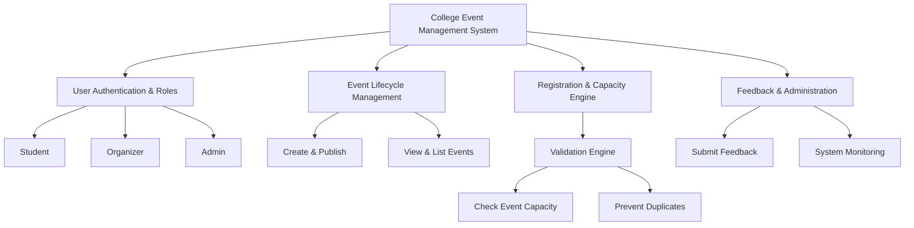
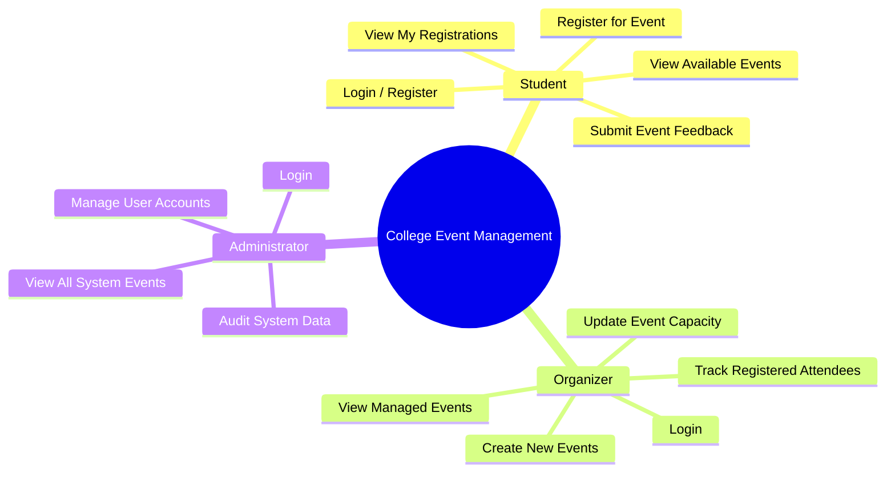
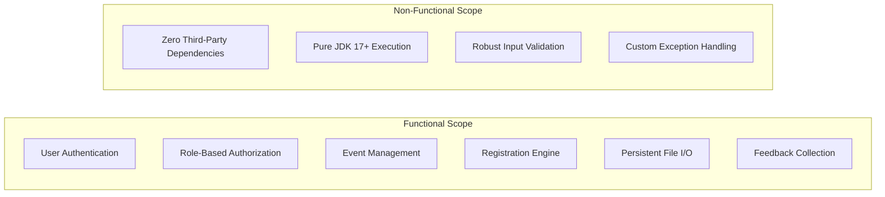
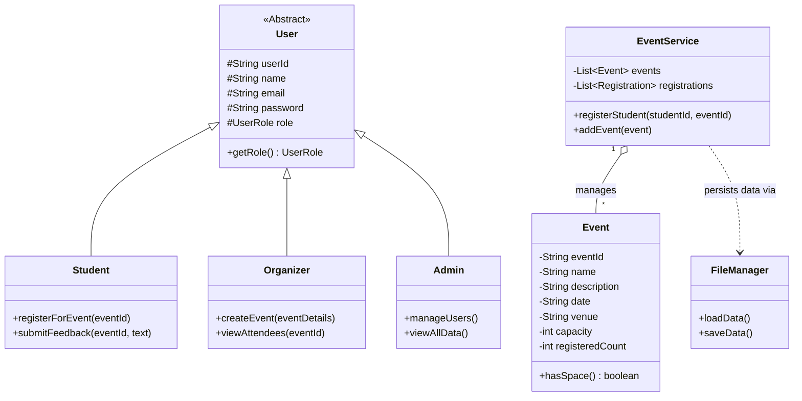

# STATEMENT OF WORK & PROBLEM STATEMENT

## VITyarthi – Build Your Own Project

---

## PROJECT TITLE: COLLEGE EVENT MANAGEMENT SYSTEM

**Technology:** Core Java (JDK 17+)  
**Application Type:** Command-Line Interface (CLI)  
**Academic Year:** 2026  

---

## 1. PROJECT OVERVIEW

The **College Event Management System** is a lightweight, pure Java command-line application designed to automate, streamline, and centralize the operational processes involved in organizing and managing campus-wide events. 

In higher education institutions, various events—such as technical symposiums, cultural festivals, workshops, sports tournaments, and guest lectures—are conducted frequently. Traditional manual methods of handling event registrations, tracking attendee capacity, managing feedback, and maintaining records are prone to administrative overhead, data duplication, and human error.

This system resolves these inefficiencies by offering a role-based, modular platform that handles event lifecycle management, student registrations, capacity enforcement, and structured feedback collection without relying on heavy external database management systems or third-party frameworks.

---

## 2. PROBLEM STATEMENT

Manual or semi-automated management of college events presents significant administrative and operational challenges:

1. **Inaccurate Registration Tracking:** Manual entry using physical spreadsheets or paper forms leads to duplicate entries, mismatched student records, and loss of data integrity.
2. **Overbooking & Capacity Violations:** Venues have fixed seating limits. Without real-time capacity checks, events risk being overbooked, creating logistical and safety hazards.
3. **Lack of Role Isolation:** General access systems often fail to restrict privileges properly, allowing unauthorized users to modify event schedules, tamper with attendee rosters, or access administrative data.
4. **Data Persistence Challenges:** Managing events across multiple sessions without a structured persistence mechanism results in lost event data upon application termination.
5. **Absent Feedback Loops:** Gathering post-event feedback manually yields low response rates and lacks direct linkage to specific event entries for qualitative analysis.

---

## 3. OBJECTIVES

The core objectives of the project are:

* **Role-Based Architecture:** Implement strict access control differentiating **Student**, **Organizer**, and **Administrator** privileges.
* **Automated Capacity Enforcement:** Design custom exception mechanisms (`EventFullException`) to dynamically prevent registrations once capacity limits are hit.
* **Duplicate Prevention:** Enforce unique constraints (`DuplicateRegistrationException`) ensuring students cannot register for the same event multiple times.
* **Lightweight Persistent Storage:** Utilize Java File I/O stream operations to store and load data seamlessly across execution runs via localized flat files (`users.txt`, `events.txt`, `registrations.txt`, `feedback.txt`).
* **Demonstration of Core Java Mastery:** Apply fundamental Object-Oriented Design patterns, custom exception hierarchies, Java Collections Framework (`List`, `Map`, `Set`), and multithreading concepts natively in Pure Java.

---

## 4. TARGET USERS & ROLE CAPABILITIES

The system categorizes users into three distinct roles, each granted specific operational rights within the menu-driven CLI:

### 4.1 Student
* View all published campus events along with venue, time, description, and available capacity.
* Register for available events.
* Review personal registration records.
* Submit qualitative feedback for completed events.

### 4.2 Organizer
* Create and schedule new events with defined limits and details.
* View roster of registered students per event.
* Manage capacity and event details.

### 4.3 Administrator
* Monitor overall system activity and stored data.
* Manage user accounts (Students, Organizers).
* View global event, registration, and feedback logs.

---

## 5. SYSTEM REQUIREMENTS & SCOPE

### 5.1 In-Scope Features

* **User Authentication:** Login and registration mechanisms backed by role validation.
* **Event Creation & Display:** Organizers publish events; students browse active listings.
* **Registration Validation Engine:** Real-time checks for seat availability and duplicate entries.
* **Flat-File Storage Engine:** File operations via standard `java.io` / `java.nio` packages.
* **Error Handling & Input Validation:** Intercepting malformed user input, unauthorized actions, and resource access faults.

### 5.2 Out-of-Scope (Future Enhancements)
* Graphical User Interface (GUI) via JavaFX or Swing (CLI interface only for current baseline).
* External RDBMS integration (MySQL, PostgreSQL, JDBC).
* Web REST APIs or remote network sockets.
* Payment gateway integrations for paid tickets.

---

## 6. HIGH-LEVEL ARCHITECTURE & STORAGE MODEL

The project follows a modular layered architectural pattern, promoting separation of concerns across data handling, business logic, model abstraction, and presentation layers.

---

## 7. HARDWARE & SOFTWARE SPECIFICATIONS

| Category | Requirement / Specification |
| :--- | :--- |
| **Operating System** | Cross-platform (Windows 10/11, macOS, Linux) |
| **Language & Runtime** | Java Development Kit (JDK 17 or higher) |
| **Interface** | Command Line Interface (Terminal / Command Prompt / PowerShell) |
| **Version Control** | Git & GitHub |
| **External Dependencies** | **None** (Standard Java Class Library / Pure Java) |
| **Minimum Hardware** | Dual-Core CPU, 2 GB RAM, 50 MB disk space |
